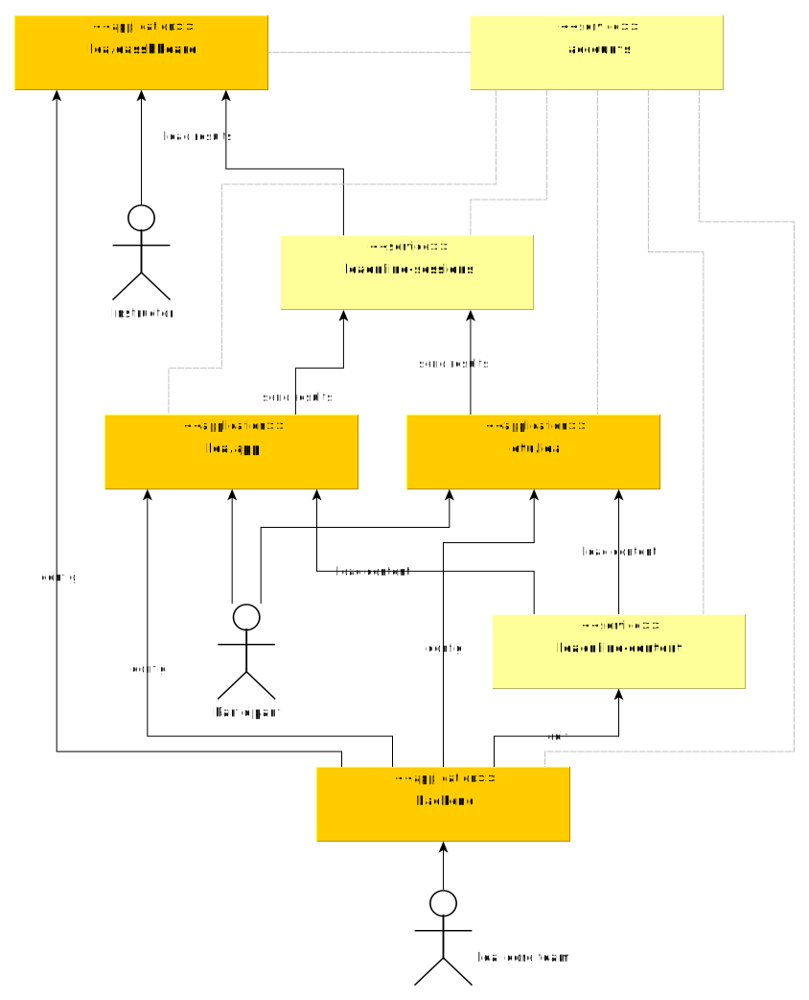

This is the main repository for documentation and development.

[Build badge]

You will find the following resources in this repository:

* [Introduction to lea.online](#introduction-to-lea.online)
* [Applications and services overview](#applications-and-services-overview)
* [Developer documentation](#developer-documentation)
* [Contribution guidelines](#contribution-guidelines)

## Introduction to lea.online

lea.online (lea= literacy education for adults) is a systematic approach to cover diagnotics and learning strategies for functional illiterates.
Currently it is tightly coupled towards a certain competency model for most basic German literacy education for adults.
In the future we may better decouple the competency model from the implementation, so we can provide this system
also for other languages.

## Applications and services overview

This section is explaining the lea.online system from an end-user perspective.
If you are a looking for a technical documentation, you may look into the [developer documentation](#developer-documentation)

The lea.online system consists of three main platforms with different focus:

- **lea.app** - mobile learning application for functional participants
- **[otu.lea](https://github.com/leaonline/leaonline-otulea)** - desktop diagnostics application for participants 
- **[teacher](https://github.com/leaonline/leaonline-teacher)** - desktop course and learning group management for instructors  

These applications communicate with different other applications from the service landscape:

- **[accounts](https://github.com/leaonline/leaonline-accounts)** - OAuth2 authentication service to authenticate users and authorize services
- **[backend](https://github.com/leaonline/leaonline-backend)** - editor and management application to manage content and app/service configurations
- **[content](https://github.com/leaonline/leaonline-content)** - stores all the static content, consumed by the main platforms
- **[sessions](https://github.com/leaonline/leaonline-sessions)** - stores all the sessions of started / completed units and item responses and their scores
- **evaluation** - evaluates the responses and replies, which competencies have been fulfilled to which extend 

### How it works

Participants can obtain access to the lea.online system by either downloading the mobile app (yet to be released) or by
accessing the websites of the learning or diagnostics application platforms.

They can **anonymously register** with a single account, that is used across the system. The [OAuth2](https://oauth.net/2/)
workflow ensures that no data is shared without proper authorization.

## Developer documentation

### Architecture

The lea.online system is a network of applications and services.
The following graphics is an overview of all involved services and applications:

### Getting started

Explain how to start now, fast, easy

### Submodules structure

This project does not include any of the `leaonline-*` applications or libraries directly but points to specific commits
of these repositories using submodules.

This has several reasons:

* There is a single entry point for newcomers
* There is one main development repository, which installs all related projects in one step
* The main repo can point to certain states, where the whole application and service system is considered stable.
  Think of it like a "snapshot" of the system beyond the state of each individual repositories.
* Contributions can occur on the submodule directories without affecting the "stable" state this repo points to
* Clear release management across multiple repositories

If you need help or want to know how to use submodules, please check out the following resources:

https://git-scm.com/book/en/v2/Git-Tools-Submodules

https://git-scm.com/docs/git-submodule

## Contribution guidelines

We appreciate every contribution to this project! Please always open an issue, before opening a PR.

## License

This repository and it's resources are [MIT licensed](./LICENSE). However, the submodules contain their own licenses and they may 
differ from the license of this one.

## Funding

This work is part of the research project "lea.online" (FKN: ????????), funded by the German Federal Ministry of 
Education and Research (BMBF)

Read more about them at the following websites:

- Blog (German language) - https://blogs.uni-bremen.de/leaonline 
- University of Bremen - https://www.uni-bremen.de/en.html
- BMBF - https://www.bmbf.de/en/index.html
