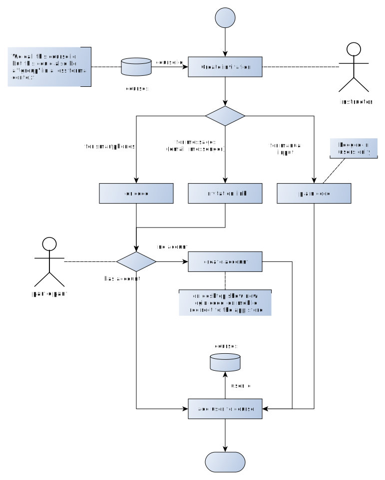

# User invitation

This specification describes a system for inviting users. The target of invitation can be an invitation to the app 
itself or to become a member of a course / group.

## Terms and concepts

- **Course** - A formal course, where participants are all physically (or virtually) present a the same time 

- **Group** - In the contet of the apps a synonym for course. The informal version of a course, where participants are managed within the same group context but do not
  necessarily need to be present at the same time 

- **Instructor** - The person that manages a course or group including their respective participants

- **Participant** - The person whose literacy is to be improved during the course or program


## Invitation Data Model

### Associations

An invitation must be associated with a user and a course in order
to define ownership (`createdBy`) and the invitation target (`courseId`).

Each invitation is expressed through a respective (system-wide, non-universal) unique invitation code (`invitationCode`).
The invitation code is used hide the course and instructor information from external sources, while associating
them through database lookup on the server. 

### Invitation code

The invitation code should be easy to understand by the participants, so it should contain always UPPERCASE characters
and no numbers.

The following characters should be omitted in order to avoid confusion:

```javascript
[ E, F, I, J, M, N, U, V ]
```

Leaving the following remaining characters:

```javascript
[ A, B, C, D, G, H, K, L, O, P, Q, S, T, X, Y, Z ]
```

The length of the code should be of 8 (eight) characters, resulting in a potential set of `4 294 967 296` codes.
    

### Expiration

In case of defining an expiration date, the data needs to contain a creation data (`createdAt`) and an
expiration date (`expiresAt`).

### Invitation document format

```javascript
{
  createdBy: String,
  createdAt: String,
  expiresAt: String | undefined,
  courseId:  String,
  code:      String
}
```

## Workflow

The following workflow is defined for inviting participants:



Source file: [invite_user.graphml](./invite_user.graphml)

### Step 1: Creating an invitation

The instructor creates a new invitation by selecting a course (`courseId`).
The invitation must be associated to a course, which implies a course alreadxy exists.

If a course does not exists, a new course must be created first. If no courses exists the invitation is simply not
available.

### Step 2: Visualize the invitation

In order to make the invitation accessible to the participant(s), the invitation needs to be visualized
into a form, that allows to point to the application and resolves to the associated `code`.

The invitation can be visualized in one of the following variations:

- **qr code** - A qr code that resolves to an URL to the invitation page. 
Should be used, when the invitee owns a mobile device with qr code scanner capabilities.

- **invitation link** - The same URL as the qr code resolves to. Should be used when a messenger
  or email communication has already been established.

- **plain code** - The `code` of the invitation wihtout any hyperlink involved. Can only be used by logged in users
  who enter this code in a specific form within their application.


The instructor should be able to display all of the above mentioned visualizations in the following ways:

- **on screen** - The visual is displayed in fullscreen-mode on the current device or on a connected projector, 
  which allows to directly involve the participant(s).
  
- **on print** - The visual is displayed in a print-ready fashion, so the instructor can print and distribute the
  invitation analog (takeaway).
  
- **via message** - The visual is wrapped in a message to be send by a given messenger software or via email.
  The invitee(s) need to open the message an actively use the contained visual (scan the qr code, click the link,
  enter the plain code) in order to continue.
  

### Step 3: Accept the invitation

The acceptance of an invitation requires an active step of the invitee(s). No action will keep the invitation in a 
pending state. If the invitation has been expired and no action for acceptance has been taken, the invitation can be
considered as denied.

If the invitee has no account, a new account will be created and the respective login code will be delivered to the
client device.

Once accepted, the participant is added to the course of the instructor and can from now on be managed by her.
